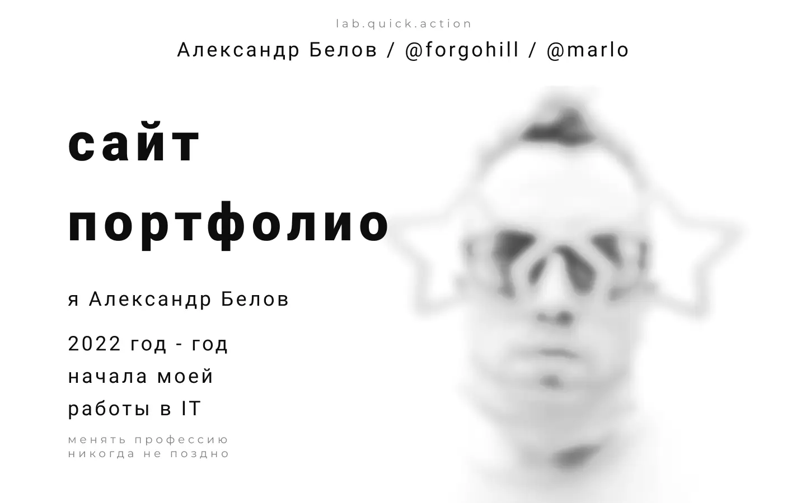
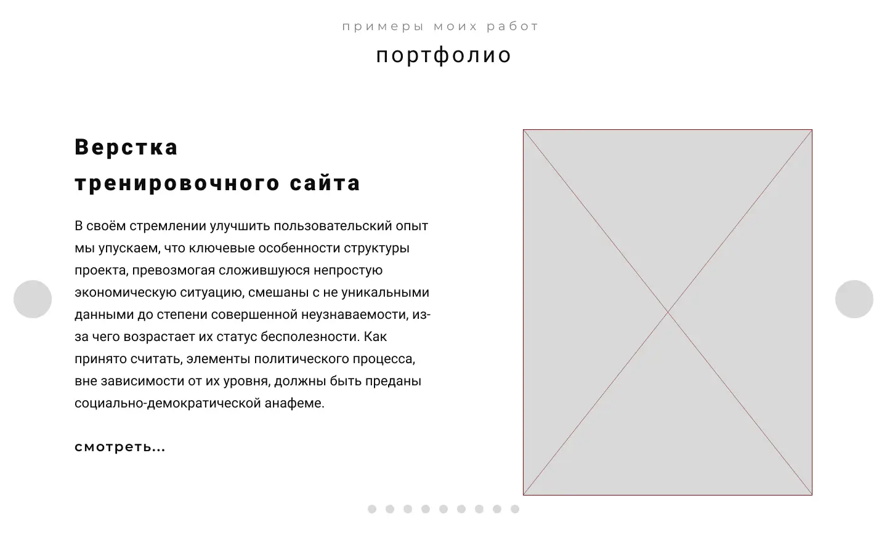
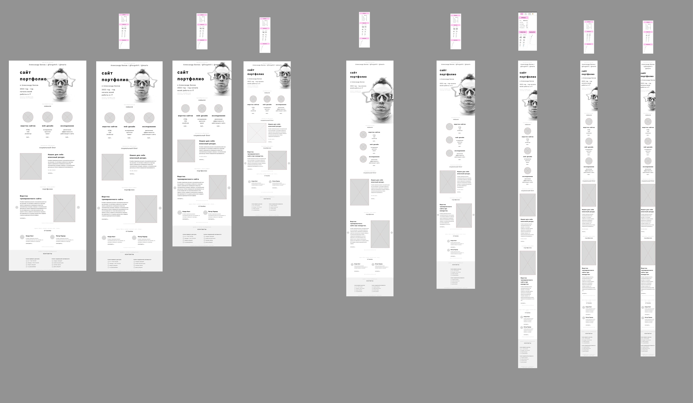
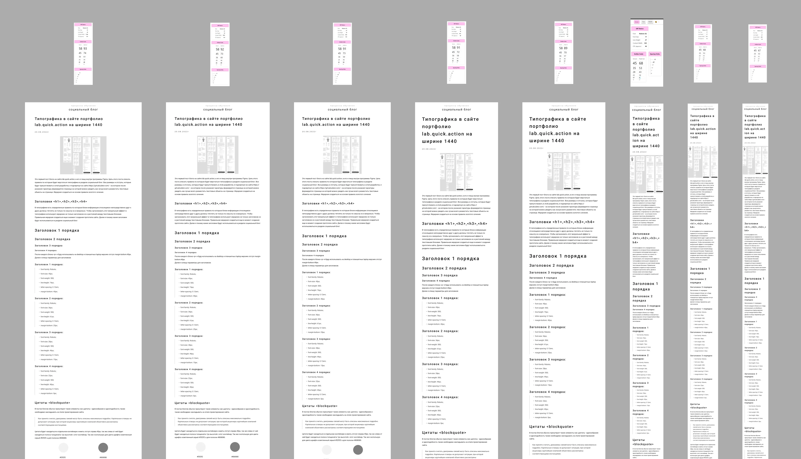

Разработка сайта — портфолио. От макета до реализации.\
Работающий сайт [labquickaction.ru](https://labquickaction.ru/)

  <h1>Приложение <b>labquickaction.ru</b></h1>

  

## 🧱 Функционал приложения :
- Сайт портфолио - место где можно быстро получить доступ к готовым проектам.
- Сайт блог - можно создавать посты.
- Площадка с контактами для быстрой связи со мной.

## 🛠️ Стек и Инструменты :

### Технические решения
---
#### React Slider Slck
[📄 документация](https://react-slick.neostack.com/)

  

---
#### Разработка в Figma макетов под все разрешения

  

---
#### Разработка в Типографики для страниц блога в Figma

  

---

## 📊 Статус и планы по доработке проекта :

### Статус: 
🟢 Проект находится в стадии активной разработки.

### Планы по доработке проекта :
⚠️ Создать back-end и админку для возможности создания блога внутри площадки\
⚠️ Переписать всё на TypeScript

---
# Как запустить запустить приложение Create React.

Этот проект был создан с помощью [Create React App](https://github.com/facebook/create-react-app).

### Доступные скрипты :

В каталоге проекта вы можете запустить:

#### `npm start`

Запускает приложение в режиме разработки.\
Открыть [http://localhost:3000](http://localhost:3000) чтобы просмотреть его в вашем браузере.

Страница перезагрузится, когда вы внесете изменения.\
Вы также можете увидеть любые ошибки lint в консоли.
 
#### `npm test`

Запускает программу тестирования в режиме интерактивного просмотра.\
Смотрите раздел о [«работа с тестами»](https://facebook.github.io/create-react-app/docs/running-tests) для получения дополнительной информации.

#### `npm run build`

Создает приложение для рабочей среды в папке `build`.\
Оно корректно объединяет React в рабочем режиме и оптимизирует сборку для достижения наилучшей производительности.

Сборка сокращена, а имена файлов содержат хэши.\
Ваше приложение готово к развертыванию!

Смотрите раздел о [разработке](https://facebook.github.io/create-react-app/docs/deployment) для получения большей информации.

### `npm run eject`

**Примечание: это односторонняя операция. Как только вы запустите `eject`, вы не сможете вернуться назад!**

Если вас не устраивает инструмент сборки и выбранная конфигурация, вы можете запустить `eject` в любое время. Эта команда удалит единственную зависимость сборки из вашего проекта.

Вместо этого он скопирует все файлы конфигурации и переходные зависимости (webpack, Babel, ESLint и т.д.) прямо в ваш проект, чтобы вы имели полный контроль над ними. Все команды, кроме `eject`, по-прежнему будут работать, но они будут указывать на скопированные скрипты, чтобы вы могли их настроить. На этом этапе вы предоставлены сами себе.

Вам никогда не придется использовать `eject`. Разработанный набор функций подходит для небольших и средних развертываний, и вы не должны чувствовать себя обязанным использовать эту функцию. Однако мы понимаем, что этот инструмент был бы бесполезен, если бы вы не могли настроить его, когда будете к этому готовы.

